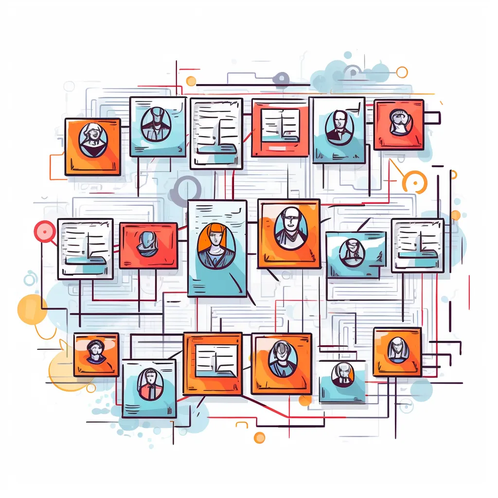
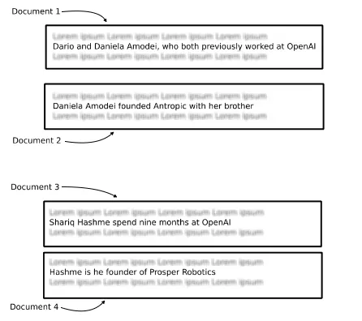
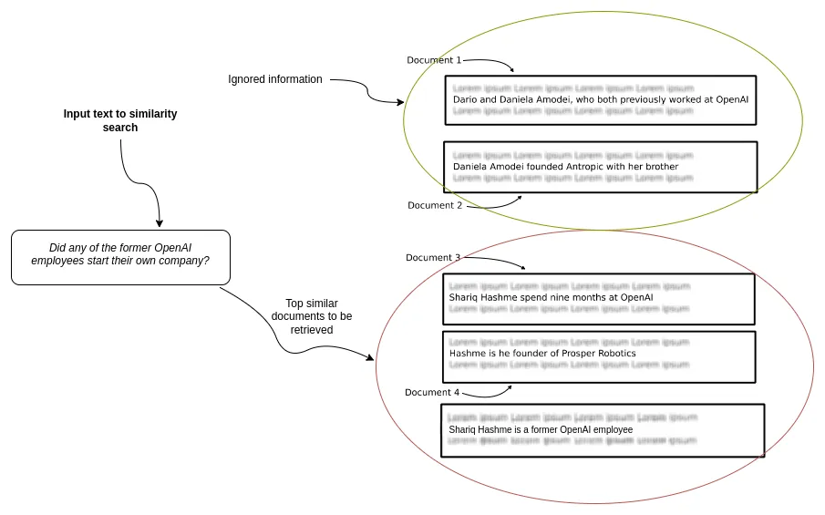
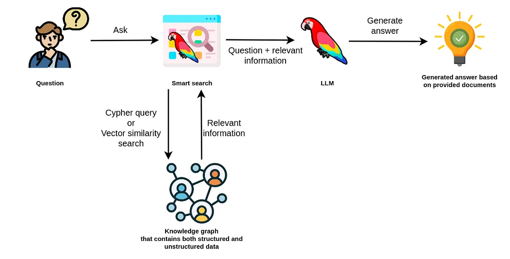
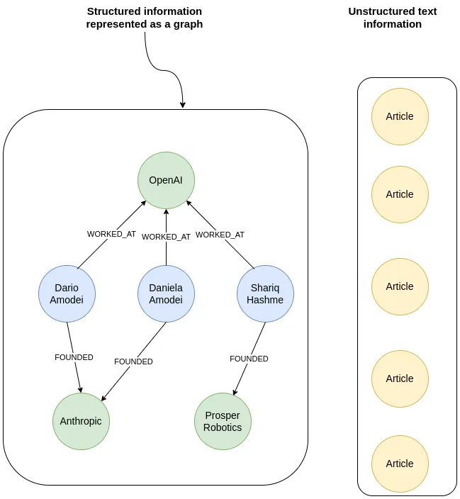

<!-----

You have some errors, warnings, or alerts. If you are using reckless mode, turn it off to see inline alerts.
* ERRORs: 0
* WARNINGs: 0
* ALERTS: 10

Conversion time: 2.739 seconds.

Using this Markdown file:

1. Paste this output into your source file.
2. See the notes and action items below regarding this conversion run.
3. Check the rendered output (headings, lists, code blocks, tables) for proper
   formatting and use a linkchecker before you publish this page.

Conversion notes:

* Docs to Markdown version 1.0β35
* Thu Feb 01 2024 02:19:15 GMT-0800 (PST)
* Source doc: Untitled document
* This is a partial selection. Check to make sure intra-doc links work.
* This document has images: check for >>>>>  gd2md-html alert:  inline image link in generated source and store images to your server. NOTE: Images in exported zip file from Google Docs may not appear in  the same order as they do in your doc. Please check the images!

WARNING:
You have 4 H1 headings. You may want to use the "H1 -> H2" option to demote all headings by one level.

----->

# **Knowledge Graphs & LLMs: Multi-Hop Question Answering**

## Retrieve information that spans across multiple documents

_This is the third blog post of Neo4j’s NaLLM project. We started this project to explore, develop, and showcase practical uses of these [LLMs in conjunction with Neo4j](https://neo4j.com/generativeai/?utm_campaign=gen-ai&utm_content=medium&utm_source=blog). As part of this project, we will construct and publicly display demonstrations in a [GitHub repository](https://github.com/neo4j/NaLLM), providing an open space for our community to observe, learn, and contribute. Additionally, we have been writing about our findings in blog posts. You can see the previous two blog posts here:_

* [Harnessing LLMs With Neo4j](https://medium.com/neo4j/harnessing-large-language-models-with-neo4j-306ccbdd2867)
* [Fine-Tuning vs Retrieval-Augmented Generation](https://medium.com/neo4j/knowledge-graphs-llms-fine-tuning-vs-retrieval-augmented-generation-30e875d63a35)

    

Midjourney’s idea of an investigative board.

In the[ previous blog post](https://medium.com/neo4j/knowledge-graphs-llms-fine-tuning-vs-retrieval-augmented-generation-30e875d63a35), we learned about the retrieval-augmented approach to overcome the limitations of Large Language Models (LLMs), such as hallucinations and limited knowledge. The idea behind the retrieval-augmented approach is to reference external data at question time and feed it to an LLM to enhance its ability to generate accurate and relevant answers.

Retrieval-augmented approach to LLM applications. Image by author.

When a user asks a question, an intelligent search tool looks for relevant information in the provided Knowledge bases. For example, you might have encountered instances of searching for relevant information within PDFs or a company’s documentation. Most of those examples use vector similarity search to identify which chunks of text might contain relevant data to answer the user’s question accurately. The implementation is relatively straightforward.

RAG applications using vector similarity search. Image by author.

The PDFs or the documentation are first split into multiple chunks of text. Some different strategies include how large the text chunks should be and if there should be any overlap between them. In the next step, vector representations of text chunks are generated by using any of the available text embedding models. That is all the preprocessing needed to perform a vector similarity search at query time. The only step left is to encode the user input as a vector at query time and use cosine or any other similarity to compare the distance between the user input and the embedded text chunks. Most frequently, you will see that the top three most similar documents are returned to provide the context to the LLM to enhance its capability to generate accurate answers. This approach works fairly well when the vector search can produce relevant chunks of text.

However, simple vector similarity search might not be sufficient when the LLM needs information from multiple documents or even just multiple chunks to generate an answer.

For example, consider the following question:

_Did any of the former OpenAI employees start their own company?_

If you think about it, this question can be broken down into two questions.

* Who are the former employees of OpenAI?
* Did any of them start their own company?

Information spanning across multiple documents. Image by author.

Answering these types of questions is a **multi-hop question-answering task**, where a single question can be broken down into multiple sub-questions and can require numerous documents to be provided to the LLM to generate an accurate answer.

The above-mentioned workflow of simply chunking and embeddings documents in a database and then using plain vector similarity search might struggle with multi-hop questions due to:

* **Repeated information in top N documents**: The provided documents are not guaranteed to contain complementary and complete information needed to answer a question. For example, the top three similar documents might all mention that _Shariq_ worked at _OpenAI_ and possibly founded a company while completely ignoring all the other former employees that became founders
* **Missing reference information:** Depending on the chunk sizes, you might lose the reference to the entities in the documents. This can be partially solved by chunk overlaps. However, there are also examples where the references point to another document, so some sort of co-reference resolution or other preprocessing would be needed.
* **Hard to define ideal N number of retrieved documents**: Some questions require more documents to be provided to an LLM to accurately answer the question, while in other situations, a large number of provided documents would only increase the noise (and cost).

    

An example where the similarity search might return some duplicated information, while other relevant information could be ignored due to a low K number of retrieved information or embedding distance. Image by the author.

Therefore, a plain vector similarity search might struggle with multi-hop questions. However, we can employ multiple strategies to attempt to answer multi-hop questions requiring information from various documents.

## **Knowledge Graph as Condensed Information Storage**

If you are paying close attention to the LLM space, you might have come across the idea of using various techniques to condense information for it to be more easily accessible during query time. For example, you [could use an LLM to provide a summary of documents](https://medium.com/google-cloud/how-to-use-llms-to-generate-concise-summaries-of-text-a04966659ed) and then embed and store the summaries instead of the actual documents. Using this approach, you could remove a lot of noise, get better results, and worry less about prompt token space.

The same approach can be applied to [summarize conversation history](https://python.langchain.com/en/latest/modules/memory/types/summary_buffer.html) to avoid running into _token limit problems_.

I haven’t seen any articles about combining and summarizing multiple documents as a single record. The problem is probably that there are too many combinations of documents that we could merge and summarize. Therefore, it is perhaps _too costly to process all the combinations_ of documents at ingestion time. \
However, a knowledge graph can help here too.

The process of extracting structured information in the form of entities and relationships from unstructured text has been around for some time and is better known as [the information extraction pipeline](https://towardsdatascience.com/extract-knowledge-from-text-end-to-end-information-extraction-pipeline-with-spacy-and-neo4j-502b2b1e0754). The beauty of combining an information extraction pipeline with knowledge graphs is that you can process each document individually, and the information from different records gets connected when the knowledge graph is constructed or enriched.

Extracting entities and relationships from text to construct a knowledge graph. Image by author.

The knowledge graph used nodes and relationships to represent data. In this example, the first document provided the information that _Dario_ and _Daniela_ used to work at _OpenAI_, while the second document offered information about their _Anthropic_ startup. Each record was processed individually, yet **_the knowledge graph representation connects the data_** and makes it easy to answer questions spanning across multiple documents.

Most of the newer approaches using LLMs to answer multi-hop questions we encountered focus on solving the task at query time. However, we believe that many multi-hop question-answering issues can be solved by preprocessing data before ingestion and connecting it in a knowledge graph. The information extraction pipeline can be [performed using LLMs](https://medium.com/neo4j/creating-a-knowledge-graph-from-video-transcripts-with-gpt-4-52d7c7b9f32c) or [custom text domain models](https://medium.com/neo4j/monitoring-the-cryptocurrency-space-with-nlp-and-knowledge-graphs-92a1cfaebd1a).

In order to retrieve information from the knowledge graph at query time, we have to construct an appropriate Cypher statement. Luckily, LLMs are pretty good at translating natural language to Cypher graph-query language.

Using knowledge graphs as part of retrieval-augmented LLM applications. Image by author.

In this example, the smart search uses an LLM to generate an appropriate Cypher statement to retrieve relevant information from a knowledge graph. The relevant information is then passed to another LLM call, which uses the original question and the provided information to generate an answer. In practice, you could use different LLMs for generating Cypher statements and answers or use various prompts on a single LLM.

# **Combining Graph and Textual Data**

Sometimes, you might want to combine textual and graph data to find relevant information. For example, consider the following question:

_What is the latest news about Prosper Robotics founders?_

In this example, you might want to identify the Prosper Robotics founders using the knowledge graph structure and retrieve the latest articles mentioning them.

Knowledge graph with explicit links between structured information and unstructured text. Image by author.

To answer the question about the latest news about Prosper Robotics founders, you would start from the Prosper Robotics node, traverse to its founders, and then retrieve the latest articles mentioning them.

A knowledge graph can be used to represent structured information about entities and their relationships, as well as unstructured text as node properties. Additionally, you could employ natural language techniques like named entity recognition to connect unstructured information to relevant entities in the knowledge graph, as shown with the **MENTIONS** relationship.

We believe that the future of retrieval-augmented generation applications is utilizing both structured and unstructured information to generate accurate answers. Therefore, a knowledge graph is a perfect solution because you can store both structured and unstructured data and connect them with explicit relationships, making information more accessible and easier to find.

Using Cypher and vector similarity search to retrieve relevant information from a knowledge graph. Image by author.

When the knowledge graph contains structured and unstructured data, the smart search tool could utilize Cypher queries or vector similarity search to retrieve relevant information. In some cases, you could also use a combination of the two. For example, you could start with a Cypher query to identify relevant documents and then use vector similarity search to find specific information within those documents.

# **Using Knowledge Graphs in Chain-of-Thought Flow**

Another very exciting development around LLMs is the so-called [chain-of-thought question answering](https://cobusgreyling.medium.com/chain-of-thought-prompting-llm-reasoning-147a6cdb312b), especially with [LLM agents](https://python.langchain.com/en/latest/modules/agents.html). The idea behind LLM agents is that they can decompose questions into multiple steps, define a plan, and use any of the provided tools. In most cases, the agent tools are APIs or knowledge bases that the agent can access to retrieve additional information. Let’s again consider the following question:

_What is the latest news about Prosper Robotics founders?_

    

No explicit links between knowledge graph entities and unstructured text. Image by author.

Suppose you don’t have explicit connections between articles and entities they mention. The articles and entities could even be in separate databases. In this case, an LLM agent using chain-of-thought flow would be very helpful. First, the agent would decompose the question into sub-questions.

* Who are the founders of Prosper Robotics?
* What is the latest news about them?

Now, an agent could decide which tool to use. Suppose we provide it with a knowledge graph access that it can use to retrieve structured information. Therefore, an agent could choose to retrieve the information about the founders of Prosper Robotics from a knowledge graph. As we already know, the founder of Prosper Robotics is Shariq Hashme. Now that the first question was answered, the agent could rewrite the second subquestion as:

* What is the latest news about Shariq Hashme?

The agent could use any of the available tools to answer the subsequent question. The tools can range from knowledge graphs, document or vector databases, various APIs, and more. Having access to structured information allows LLM applications to perform various analytics workflows where aggregation, filtering, or sorting is required. Consider the following questions:

* Which company with a solo founder has the highest valuation?
* Who founded the most companies?

Plain vector similarity search can struggle with these types of analytical questions since it searches through unstructured text data, making it hard to sort or aggregate data. Therefore, a combination of structured and unstructured data is probably the future of retrieval-augmented LLM applications. Additionally, as we have seen, knowledge graphs are also ideal for representing connected information and, consequently, multi-hop queries.

While the chain-of-thought is a fascinating development around LLMs as it shows how an LLM can reason, it is not the most user-friendly as the response latency can be high due to multiple LLM calls. However, we are still very excited to understand more about incorporating knowledge graphs into chain-of-thought flows for various use cases.

# **Summary**

Retrieval-augmented generation applications often require retrieving information from multiple sources to generate accurate answers. While textual summarization can be challenging, representing information in a graph format can offer several advantages.

By processing each document separately and connecting them in a knowledge graph, we can construct a structured representation of the information. This approach allows for easier traversal and navigation through interconnected documents, enabling multi-hop reasoning to answer complex queries. Furthermore, constructing the knowledge graph during the ingestion phase reduces the workload during query time, resulting in improved latency.

Another advantage of using a knowledge graph is its ability to store both structured and unstructured information. This flexibility makes a [knowledge graphs suitable](https://neo4j.com/generativeai/?utm_campaign=gen-ai&utm_content=medium&utm_source=blog) for a wide range of language model (LLM) applications, as it can handle various data types and relationships between entities. The graph structure provides a visual representation of the knowledge, facilitating transparency and interpretability for both developers and users.

Overall, leveraging knowledge graphs in retrieval-augmented generation applications offers benefits such as improved query efficiency, multi-hop reasoning capabilities, and support for structured and unstructured information.

Keep an eye out for updates from our team as we progress the development of this project, all of which will be openly documented on our [GitHub repository](https://github.com/manasa-sk/NaLLM).
