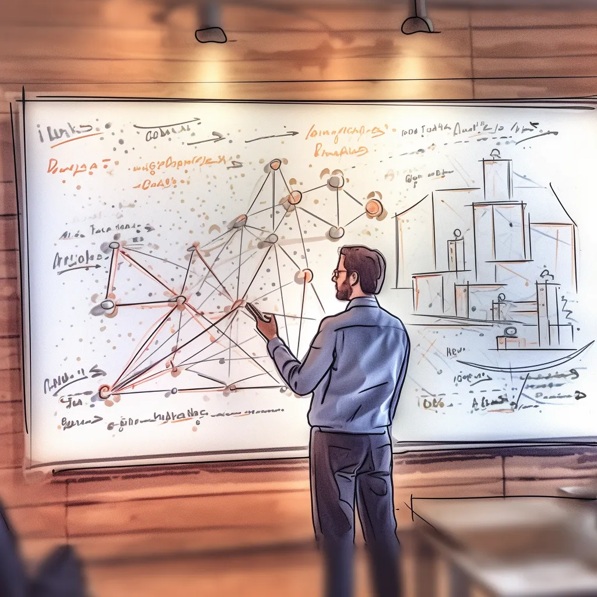
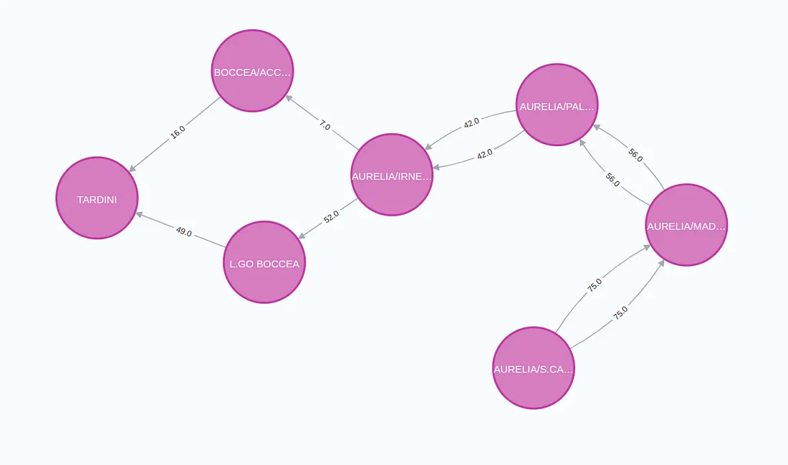
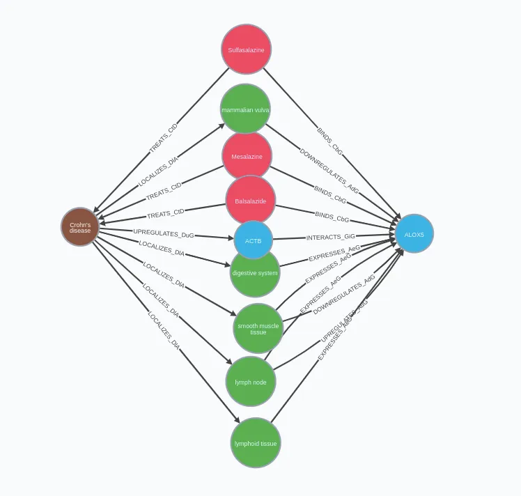
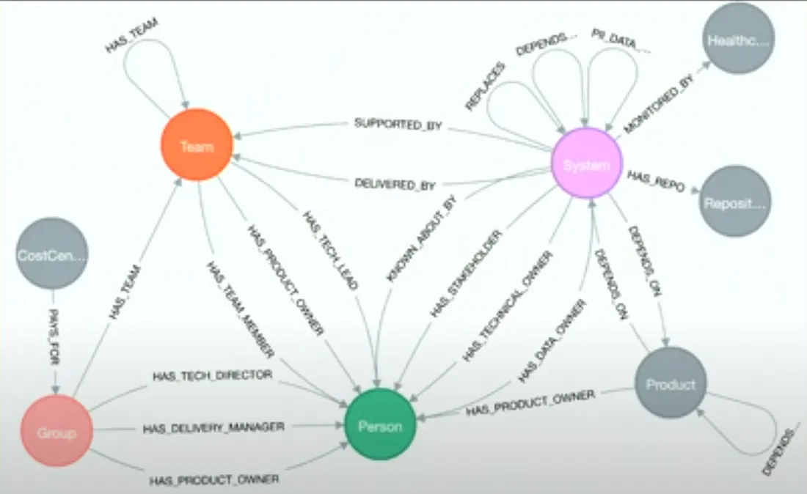
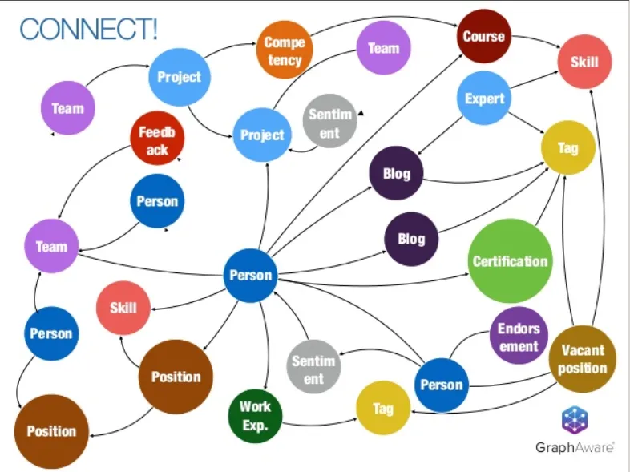

<!-----

You have some errors, warnings, or alerts. If you are using reckless mode, turn it off to see inline alerts.
* ERRORs: 0
* WARNINGs: 0
* ALERTS: 8

Conversion time: 2.549 seconds.

Using this Markdown file:

1. Paste this output into your source file.
2. See the notes and action items below regarding this conversion run.
3. Check the rendered output (headings, lists, code blocks, tables) for proper
   formatting and use a linkchecker before you publish this page.

Conversion notes:

* Docs to Markdown version 1.0β35
* Sun Feb 04 2024 19:57:48 GMT-0800 (PST)
* Source doc: Untitled document
* This document has images: check for >>>>>  gd2md-html alert:  inline image link in generated source and store images to your server. NOTE: Images in exported zip file from Google Docs may not appear in  the same order as they do in your doc. Please check the images!

WARNING:
You have 5 H1 headings. You may want to use the "H1 -> H2" option to demote all headings by one level.

----->

# **Knowledge Graphs & LLMs: Real-Time Graph Analytics**

## Understanding data points through the context of their relationships

_This is the fourth blog post of Neo4j’s NaLLM project. We started this project to explore, develop, and showcase practical uses of these LLMs in conjunction with Neo4j. As part of this project, we will construct and publicly display demonstrations in a GitHub repository, providing an open space for our community to observe, learn, and contribute. Additionally, we are writing about our findings in a blog post. You can read the previous three blog posts here:_

* _[Harnessing LLMs with Neo4j](https://medium.com/neo4j/harnessing-large-language-models-with-neo4j-306ccbdd2867)_
* _[Fine-tuning vs. Retrieval-augmented generation](https://medium.com/neo4j/knowledge-graphs-llms-fine-tuning-vs-retrieval-augmented-generation-30e875d63a35)_
* _[Multi-hop Question Answering](https://medium.com/neo4j/knowledge-graphs-llms-multi-hop-question-answering-322113f53f51)_

Graph data analyst as imagined by Midjourney.

Large Language Models (LLMs) have significantly changed data accessibility to the average person. Less than a year ago, accessing the company’s data required technical skills involving proficiency in numerous dashboarding tools or even diving into the intricacies of a database query language. Yet, with the rise of LLMs like ChatGPT, the wealth of knowledge hidden within private databases or accessible via various APIs is now more readily available than ever with the rise of so-called retrieval-augmented LLM applications.

Retrieval-augmented generation application. Image by author.

The idea behind retrieval-augmented applications is to retrieve additional information from various sources to allow the LLM to generate better and more accurate results. It seems OpenAI has also picked up on this trend as they [introduced OpenAI functions](https://openai.com/blog/function-calling-and-other-api-updates) recently. The new OpenAI models are trained to use provide parameters to functions (or what other libraries call [tools](https://python.langchain.com/docs/modules/agents/tools/)), whose signatures and descriptions are passed in the context, to retrieve additional information at query time if needed.

We have observed a strong bias for vector similarity search in retrieval-augmented applications. If you opened Twitter or LinkedIn in the past three months, you might have seen the various “Chat with your PDFs” applications. In those examples, the implementation is relatively straightforward. The text is extracted from PDFs, split into chunks if needed, and finally stored in a vector database along with its text embedding representations.

The barrier to entry with these types of applications is low, especially if you are dealing with small amounts of data. It is fascinating that so many [articles giving the impression that only vector databases are relevant](https://a16z.com/2023/06/20/emerging-architectures-for-llm-applications/) for retrieval-augmented applications are published nowadays.

While there is immense power in vector similarity-based information retrieval from unstructured text, we believe that structured information has an important role to play in LLM applications.

Last time we wrote about [multi-hop question answering](https://medium.com/neo4j/knowledge-graphs-llms-multi-hop-question-answering-322113f53f51) and how knowledge graphs can help solve problems of retrieving information from multiple documents to generate an accurate answer. Additionally, we hinted that vector similarity search is not designed for analytics workflows, where we rely on structured information.

## **[Knowledge Graphs & LLMs: Multi-Hop Question Answering](https://medium.com/neo4j/knowledge-graphs-llms-multi-hop-question-answering-322113f53f51?source=post_page-----89b392eaaa95--------------------------------)**

### [Retrieve information that spans across multiple documents](https://medium.com/neo4j/knowledge-graphs-llms-multi-hop-question-answering-322113f53f51?source=post_page-----89b392eaaa95--------------------------------)

[medium.com](https://medium.com/neo4j/knowledge-graphs-llms-multi-hop-question-answering-322113f53f51?source=post_page-----89b392eaaa95--------------------------------)

For example, questions like:

* Who could introduce me to Emil Eifrém (CEO of Neo4j)?
* How is ALOX5 gene related to Crohn’s disease?
* When we have a particular microservice outage, how does it affect our products?
* How does a flight delay propagate through the network?
* Which users can be credited for a social media post virality?

All these questions require highly-connected information to be able to answer the question accurately. For example, to learn who can introduce you to Emil, you need information about relationships between people.

On the other hand, you need to map dependencies between your microservices and products in order to evaluate the scale and severity of a particular microservice failure.

In this blog post, we will introduce some of the **_frequent use cases of real-time graph analytics_** that you might want to implement into your LLM applications.

# **Finding (Shortest) Paths**

Relationships are first-class citizens in native graph databases. Although knowledge graphs allow you to perform typical aggregations and filtering to answer questions like “How many customers did we get this week?”, we will focus more on analytical use cases where traversing the relationships is the main component. One such example is finding the shortest or all possible paths between data points. For example, to answer the question:

_Who could introduce me to Emil Eifrem?_

We would have to find the shortest path between myself and Emil Eifrem in the graph.

Single shortest path. Image by author.

Another use case where finding the shortest paths in real-time would come in handy is in any sort of transportation, logistics, or routing application. In these applications, you might want to evaluate the top N shortest paths to ensure some fallback plan if something unexpected happens.

Top two shortest paths between stops in Rome. Image by author.

This image visualizes the top 2 shortest paths between two stops in Rome. Such shortest paths could be optimized for distance, time, cost, or a combination.

Another domain where finding paths between data points in your LLM applications is the biomedical domain. In the biomedical domain, you are dealing with genes, proteins, diseases, drugs, and more. What’s perhaps more important is that these entities do not exist in isolation but have complex, often multilayered relationships with each other.

For instance, a gene may be associated with multiple diseases, a protein may interact with numerous other proteins, a disease might be treatable by a variety of drugs, and a drug could have multiple effects on different genes and proteins.

Given the staggering amount of biomedical data available, the number of potential relationships between these data points is enormous and is a great candidate to be represented as a knowledge graph.

All shortest paths between Crohn’s disease and ALOX5 gene using [Hetionet dataset](https://het.io/). Image by author.

Biomedical knowledge graph can support LLM applications where users are be interested in answering questions like

_How is ALOX5 gene related to Crohn’s disease?_

While most LLM applications we see today generate answers as a natural language, there is also an excellent opportunity for returning responses in the form of line, bar, or even network visualizations. Often the LLM can even return the configuration structure needed for the charting libraries.

# **Information Propagating Through Network**

Another strong knowledge graph fit is domains with networks of dependencies. For example, you could have a knowledge graph containing the complete [microservice architecture of your system](https://neo4j.com/use-cases/network-and-it-operations/). Such a knowledge graph would allow you to power a DevOps chatbot that would enable you to evaluate the architecture in real-time and perform what-if analysis.

Microservices & People graph. Screenshot from [https://www.youtube.com/watch?v=_qakAUjXiek&t=2517s](https://www.youtube.com/watch?v=_qakAUjXiek&t=2517s)

Also Rhys Evans presented how the [Financial Times manages their infrastructure as a graph](https://www.youtube.com/watch?v=6vblSC1kShI).

Another domain that comes to mind is the supply chain.

Incorporating [supply chain data into knowledge graphs](https://neo4j.com/use-cases/supply-chain-management/) can significantly enhance the capabilities of large language applications. This approach allows us to structure complex supply chain information into nodes and relationships, thereby generating a holistic picture of how materials, components, and products flow from suppliers to customers. The inherent interconnections and dependencies become evident and analyzable.

For language applications, this enables deeper context understanding and knowledge generation. For instance, an AI model like ChatGPT can leverage this data structure to produce more accurate and insightful responses about supply chain scenarios, disruptions, or management strategies. It could comprehend and explain the ripple effects of a shortage of a certain component, predict potential bottlenecks, or suggest optimization strategies.

_By aligning the intricacies of supply chain dynamics with the cognitive abilities of AI, we can bolster the functionality and value of large language applications in a multitude of industrial and commercial contexts._

# **Social Network Analysis and Data Science**

What if your company chatbot went beyond documentation and helped deliver insights and recommendations as part of the people analytics?

[Knowledge graphs in HCM](https://neo4j.com/use-cases/master-data-management/) can serve as an invaluable tool in driving people analytics within a company, primarily by creating a robust, interconnected system of information that allows for a deep, holistic understanding of employee behavior, skills, competencies, interactions, and performance. Essentially, a knowledge graph captures and links complex employee data — including demographic information, role history, project involvement, performance indicators, and skillsets — allowing for multi-faceted analysis.

This combination of connected data and ML powered tools enable human resources and team leaders to uncover hidden patterns, identify high-potential individuals, predict future performance, assess skill gaps, and inform training needs, thereby fueling data-driven decision-making. By leveraging a knowledge graph, companies can streamline talent management and development processes, enhancing overall organizational effectiveness and fostering a culture of continuous learning and improvement.

Incorporating a chatbot interface into this knowledge graph-driven people analytics system could revolutionize the way companies approach HR and talent management. Here’s how:

## **User-Friendly Access to Complex Data**

A chatbot interface provides an intuitive, conversational manner for users to interact with complex datasets. Employees, managers, or HR staff wouldn’t need to understand intricate databases or analytics tools; they could simply ask the chatbot questions about employee performance, skills, or team dynamics.

The chatbot, equipped with natural language processing capabilities, would interpret the question, retrieve the relevant information from the knowledge graph, and deliver the response in an understandable format.

## **Real-Time Insights**

The chatbot interface could offer immediate access to data insights, enabling timely decisions.

If a manager wanted to know how many projects are in the pipeline and which people are a good fit and available for a specific project, they could ask the chatbot and get an answer in real-time rather than waiting for a comprehensive report.

## **Scalable Training and Support**

The chatbot could provide individualized support to employees, answering questions about company policies, procedures, or career development opportunities.

It could even deliver personalized training recommendations (and perhaps the actual training itself) based on an individual’s role, skills, and career goals. This would democratize access to learning and development resources, making it easier for employees to upskill or reskill.

## **Predictive Analysis**

Advanced AI chatbots could analyze patterns and trends from the knowledge graph to make predictions, such as which employees might be at risk of leaving the company or what skills may be in demand in the future. These predictive analytics capabilities could help companies be proactive rather than reactive in their HR strategies.

In essence, integrating a chatbot interface with a knowledge graph-driven people analytics system would make complex employee data more accessible, actionable, and useful to all members of an organization. It would be a game-changer in talent management and development, driving a more data-informed, proactive, and personalized approach to HR.

# **Summary**

In conclusion, as we traverse deeper into the era of large language models, we must keep in mind the **_enormous potential of knowledge graphs in structuring, organizing, and retrieving information_** in these applications. The combination of structured and unstructured data retrieval paves the way for more accurate, reliable, and impactful results, extending beyond natural language answers into the realm of visually represented information.

Despite the popularity of vector similarity-based data retrieval (recall), we should not underestimate the role of structured information and the immense value it brings to LLM applications. Whether it’s finding the shortest paths, understanding complex biomedical relationships, analyzing supply chain scenarios, or revolutionizing HR with people analytics, the applications of knowledge graphs are vast and profound. We believe the future of LLM-based applications is the combination of vector similarity search approach coupled with database query languages such as Cypher.

Through this blog post, we’ve explored some exciting real-time graph analytics use cases that could be implemented into your LLM applications. This is only the beginning. We anticipate a future where large language models will work more cohesively with knowledge graphs, bringing about more innovative solutions to real-world problems.
