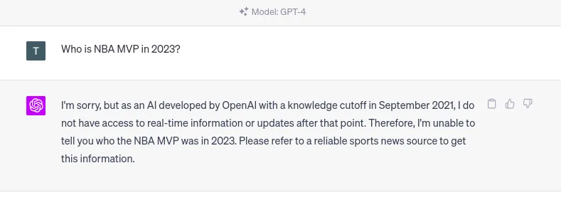
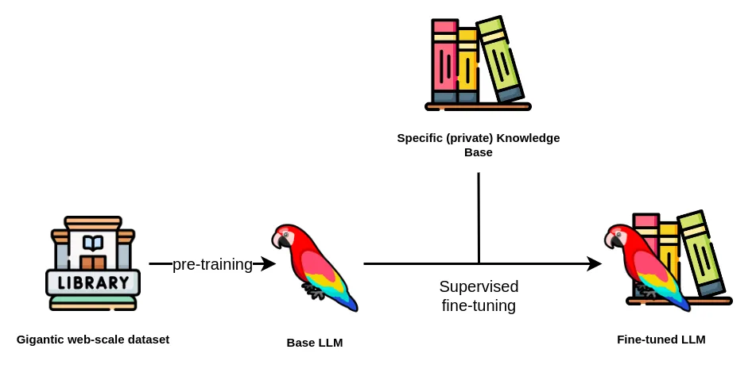
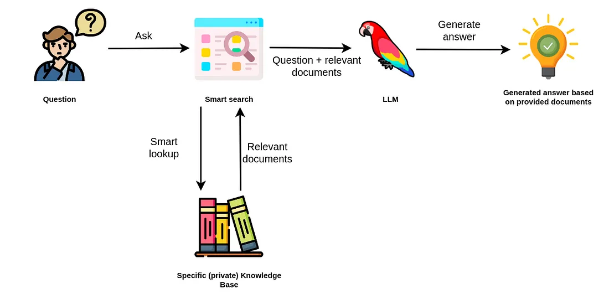
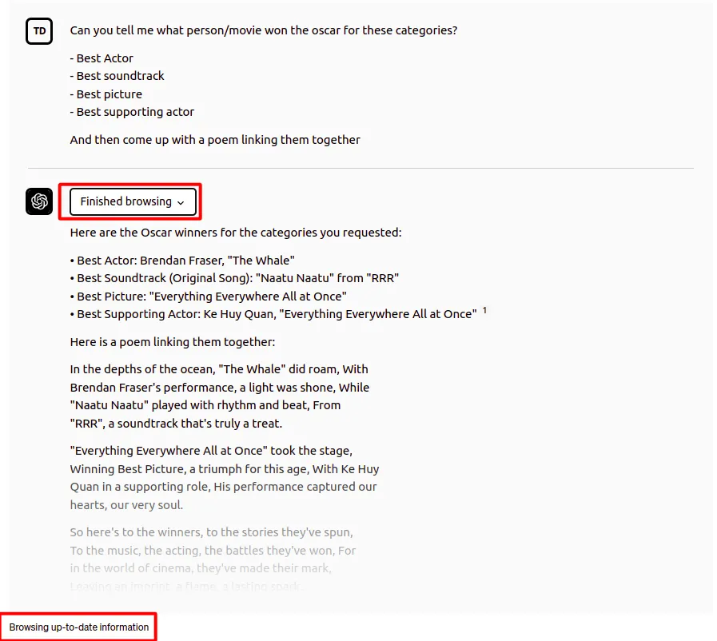
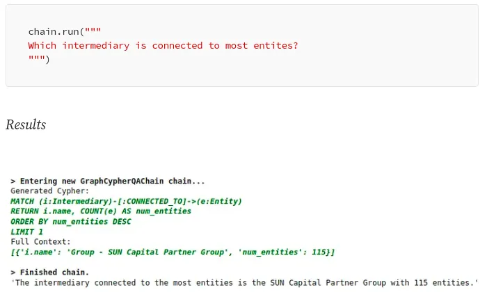

<!-----

You have some errors, warnings, or alerts. If you are using reckless mode, turn it off to see inline alerts.
* ERRORs: 0
* WARNINGs: 0
* ALERTS: 7

Conversion time: 1.937 seconds.

Using this Markdown file:

1. Paste this output into your source file.
2. See the notes and action items below regarding this conversion run.
3. Check the rendered output (headings, lists, code blocks, tables) for proper
   formatting and use a linkchecker before you publish this page.

Conversion notes:

* Docs to Markdown version 1.0β35
* Thu Feb 01 2024 00:46:59 GMT-0800 (PST)
* Source doc: Untitled document
* This document has images: check for >>>>>  gd2md-html alert:  inline image link in generated source and store images to your server. NOTE: Images in exported zip file from Google Docs may not appear in  the same order as they do in your doc. Please check the images!

WARNING:
You have 3 H1 headings. You may want to use the "H1 -> H2" option to demote all headings by one level.

----->
# **Knowledge Graphs & LLMs: Fine-Tuning Vs. Retrieval-Augmented Generation**

**What are the limitations of LLMs, and how to overcome them**

Midjourney’s idea of a knowledge graph chatbot.

_This is the second blog post of Neo4j’s NaLLM project. We started this project to explore, develop, and showcase [practical uses of these LLMs in conjunction with Neo4j](https://neo4j.com/generativeai/?utm_campaign=gen-ai&utm_content=medium&utm_source=blog). As part of this project, we will construct and publicly display demonstrations in a [GitHub repository](https://github.com/neo4j/NaLLM), providing an open space for our community to observe, learn, and contribute. Additionally, we are writing about our findings in a blog post. You can find the first and third blog posts here:_

* [Harnessing LLMs With Neo4j](index.md)
* [Multi-Hop Question Answering](https://medium.com/neo4j/knowledge-graphs-llms-multi-hop-question-answering-322113f53f51)

The first wave of hype for Large Language Models (LLMs) came from ChatGPT and similar web-based chatbots, where the models are so good at understanding and generating text that it shocked people, myself included.

Many of us logged in and tested its ability to write haikus, motivational letters, or email responses. What became quickly apparent is that LLMs are not only good at generating creative context but also at solving typical natural language processing and other tasks.

Shortly after the LLM hype started, people started considering integrating it into their applications. Unfortunately, if you simply develop a wrapper around an LLM API, there is a high chance your application will not be successful as it doesn’t provide additional value.

One major problem of LLMs is the so-called **knowledge cutoff**. The knowledge cutoff term indicates that LLMs are **_unaware of any events that happened after their training_**. For example, if you ask ChatGPT about an event in 2023, you will get the following response.

ChatGPT’s knowledge cutoff date. Image by author.

The same problem will occur if you ask an LLM about **_any event not present_** in its training dataset. While the knowledge cutoff date is relevant for any publicly available information, the LLM doesn’t have any knowledge about **_private or confidential information_** that might be available even before the knowledge cutoff date.

For example, most companies have some confidential information that they don’t share publicly but might be interested in having a custom LLM that could answer those questions. On the other hand, a lot of the publicly available information that the LLM is aware of might be already outdated.

_Therefore, updating and expanding the knowledge of an LLM is highly relevant today._

Another problem with LLMs is that they are trained to produce realistic-sounding text, which **_might not be accurate_**. Some invalid information is more challenging to spot than others. Especially for missing data, it is very probable that the LLM will make up an answer that sounds convincing but is nonetheless wrong instead of admitting that it lacks the base facts in its training.

For example, research or court citations might be easier to verify. A week ago, a [lawyer got in trouble for blindly believing the court citations ChatGPT produced](https://edition.cnn.com/2023/05/27/business/chat-gpt-avianca-mata-lawyers/index.html).

I have also noticed that LLMs will consistently **_produce assertive, yet false information about any sort of IDs_** like the WikiData or other identification numbers.

    

ChatGPT’s hallucinations. Image by author.

Since the response by ChatGPT is assertive, you might expect it to be accurate. However, the given WikiData id points to a farm in England. Therefore, you have to be very careful not to blindly believe everything that LLMs produce. Verifying answers or producing more accurate results from LLMs is another big problem that needs to be solved.

Of course, LLMs have other problems, like bias, prompt injection, and others. However, we will not talk about them here. Instead, in this blog post, we will present and focus on the **_concepts of fine-tuning and retrieval-augmented LLMs_** and evaluate their pros and cons.

# **Supervised Fine-Tuning of an LLM**

Explaining how LLMs are trained is beyond the scope of this blog post. Instead, you can watch this [incredible video by Andrej Karpathy to catch up on LLMs](https://www.youtube.com/watch?v=bZQun8Y4L2A) and learn about the different phases of LLM training.

_By fine-tuning an LLM, we refer to the **supervised training phase**, during which you provide additional question-answer pairs to optimize the performance of the Large Language Model (LLM)._

Additionally, we have identified two different use cases for fine-tuning an LLM.

**One use case** is fine-tuning a model to update and **_expand its internal knowledge_**. \
In contrast, the **other use case** is focused on fine-tuning a model **_for a specific_** task like text summarization or translating natural language to database queries.

First, we will talk about the first use case, where we use fine-tuning techniques to update and expand the internal knowledge of an LLM.

Supervised fine-tuning flow. Image by author. Icons from [Flaticons](https://www.flaticon.com/).

Usually, you want to avoid pre-training an LLM as the **cost** can be upwards of hundreds of thousands and even millions of dollars. A base LLM is pre-trained using a gigantic corpus of text corpus, frequently in the billions or even trillions of tokens.

While the **number of parameters** of an LLM is vital, it is not the only parameter you should consider when selecting a base LLM. Besides the **license**, you should also consider the **bias** and **toxicity** of the pre-training dataset and the base LLM.

After you have selected the base LLM, you can start the next step of fine-tuning it. The fine-tuning step is relatively cheap regarding computation cost due to available techniques like the [LoRa](https://huggingface.co/blog/lora) and [QLoRA](https://arxiv.org/abs/2305.14314).

However, **_constructing a training dataset_** is more complex and can get expensive. If you can not afford a dedicated team of annotators, it seems that the trend is to **_use an LLM to construct a training dataset_** to fine-tune your desired LLM (this is really meta).

For example,[ Stanford’s Alpaca training dataset was created using OpenAI’s LLMs](https://crfm.stanford.edu/2023/03/13/alpaca.html). The cost to produce 52 thousand training instructions was about 500 dollars, which is relatively cheap.

On the other hand, the [Vicuna model was fine-tuned by using the ChatGPT conversations users posted on ShareGPT.com](https://lmsys.org/blog/2023-03-30-vicuna/).

There is also a relatively [fresh project by H2O called WizardLM](https://github.com/h2oai/h2o-wizardlm), which is designed to turn documents into question-answer pairs that can be used to fine-tune an LLM.

We haven’t found any recent articles describing how to use a knowledge graph to prepare good question-answer pairs that can be used to fine-tune an LLM.

This is an area that we plan to explore during the NaLLM project. We have some ideas for utilizing LLMs to construct question-answer pairs from a knowledge graph context.

**However, there are a lot of unknowns at the moment.**
**For example, can you provide _two different answers_ to the same question, and the LLM then somehow combines them in its internal knowledge store?**

Another consideration is that some information in a knowledge graph is not relevant without considering its relationships. Therefore, do we have to pre-define relevant queries, or is there a more generic way to go about it? Or can we use the node-relationship-node patterns representing subject-predicate-object expressions to generate relevant pairs?

These are some of the questions we aim to answer in upcoming blog posts.

Imagine that you somehow managed to produce a training dataset containing question-answer pairs based on the information stored in your knowledge graph. As a result, the LLM now includes updated knowledge.

However, fine-tuning the model didn’t solve the knowledge cutoffs problem since it only pushed the knowledge cutoff to a later date.

Therefore, we recommend updating the internal knowledge of an LLM through fine-tuning techniques _only for slowly changing _or updating data. For example, you could use a fine-tuned model to provide tourist information.

However, you would run into troubles the second you would want to include special time-dependent (real-time) or personalized promotions in the responses. Similarly, fine-tuned models are not ideal for analytical workflows where you would ask how many new customers the company gained over the last week.

At the moment, _fine-tuning approaches can help mitigate hallucinations_ but cannot completely eliminate them. One problem is that the LLMs _do not cite their sources_ when providing answers. Therefore, you have no idea if the answer came from pre-training data, fine-tuning dataset, or was made up by the LLM. Additionally, there might be another possible falsehood source if you use an LLM to create the fine-tuning dataset.

Lastly, a fine-tuned model cannot automatically provide different responses _depending on the user_ making the questions. Likewise, there is no concept of access restrictions, meaning that anybody interacting with the LLM has access to all of its information.

# **Retrieval-Augmented Generation**

Large language models perform remarkably well in natural language applications like

* Text summarization,
* Extracting relevant information,
* Disambiguation of entities
* Translating from one language to another, or even
* Converting natural language into database queries or scripting code.

Moreover, previously NLP models were most often domain and task-specific, meaning that you would most likely need to train a custom natural language model depending on your use case and domain. However, thanks to the generalization capabilities of LLMs, a single model can be applied to solve various collections of tasks.

We have observed quite a strong trend in using retrieval-augmented LLMs, where instead of using LLMs to access its internal knowledge, you use the LLM **_as a natural language interface_** to your company’s or private information.

Retrieval-augmented generation. Image by author. Icons from [Flaticons](https://www.flaticon.com/).

The retrieval augmented approach uses the LLM to generate an answer based on the additionally provided relevant documents from your data source.

Therefore, you don’t rely on internal knowledge of the LLM to produce answers. Instead, the LLM is used only for extracting relevant information from documents you passed in and summarizing it.

For example, the [ChatGPT plugins](https://openai.com/blog/chatgpt-plugins) can be thought of as a retrieval-augmented approach to LLM applications. The ChatGPT interface with a browsing plugin enabled allows the LLM to search the internet to access up-to-date information and use it to construct the final answer.

ChatGPT with browsing plugin. Image by author.

In this example, ChatGPT was able to answer who won the Oscar for various categories in 2023. But, remember, the cutoff knowledge date for ChatGPT is 2021, so it couldn’t know who won the 2023 Oscars from its internal knowledge. Therefore, it accessed external information through the browsing plugin, which allowed it to answer the question with up-to-date information. Those plugins present an integrated augmentation mechanism inside the OpenAI platform.

If you have been watching the LLM space, you might have heard of the [LangChain library](https://python.langchain.com/en/latest/index.html).

The LangChain library can be used to allow LLMs to access real-time information from various sources like Google Search, vector databases, or knowledge graphs. For example, LangChain has added a [Cypher Search chain](https://towardsdatascience.com/langchain-has-added-cypher-search-cb9d821120d5), which converts natural language questions into a Cypher statement, uses it to retrieve information from the Neo4j database, and constructs a final answer based on the provided information.

With the Cypher Search chain, an LLM is not only used to construct a final answer but also to translate a natural language question into a Cypher query.

Cypher search in LangChain. Image by author.

Another popular library for retrieval-augmented LLM workflows is [LlamaIndex (GPT Index)](https://gpt-index.readthedocs.io/en/latest/index.html). LlamaIndex is a comprehensive data framework aimed at enhancing the performance of Large Language Models (LLMs) by enabling them to leverage private or custom data.

Firstly, LlamaIndex offers data connectors that facilitate the ingestion of a variety of data sources and formats, encompassing everything from APIs, PDFs, and documents to SQL or graph data.

This feature allows for an effortless integration of existing data into the LLM. Secondly, it provides efficient mechanisms to structure the ingested data using indices and graphs, ensuring the data is suitably arranged for use with LLMs. In addition, it includes an advanced retrieval and query interface, which enables users to input an LLM prompt and receive back a context-retrieved, knowledge-augmented output.

The idea behind retrieval-augmented LLM applications like ChatGPT Plugins and LangChain is to avoid relying on internal LLM knowledge only to generate answers. Instead, LLMs are used to solve tasks like [constructing database queries from natural language](https://neo4j.com/generativeai/?utm_campaign=gen-ai&utm_content=medium&utm_source=blog) and constructing answers based on externally provided information or by utilizing plugins/agents for retrieval.

The retrieval-augmented approach has some clear advantages over the fine-tuning approach:

* The answer can cite its sources of information, which allows you to validate the information and potentially change or update the underlying information based on requirements
* Hallucinations are more unlikely to occur as you don’t rely on the internal knowledge of an LLM to answer the question and only use information that is provided in the relevant documents
* Changing, updating, and maintaining the underlying information the LLM uses is easier as you transform the problem from LLM maintenance to a database maintenance, querying and context construction problem
* Answers can be personalized based on the user context, or their access permission

On the other hand, you should consider the following limitations when using the retrieval-augmented approach:

* The answers are only as good as the smart search tool
* The application needs access to your specific knowledge base, either that be a database or other data stores
* Completely disregarding the internal knowledge of the language model limits the number of questions that can be answered
* Sometimes LLMs fail to follow instructions, so there is a risk that the context might be ignored or hallucinations occur if no relevant answer data is found in the context.

# **Summary**

This blog post delves into the limitations of Large Language Models (LLMs), such as

* Knowledge cutoff,
* Hallucinations, and
* The lack of user customization.

To overcome these, we explored two concepts, namely, fine-tuning and retrieval-augmented use of LLMs.

**_Fine-tuning an LLM_** involves the supervised training phase, where question-answer pairs are provided to optimize the performance of the LLM. This can be used to update and expand the LLM’s internal knowledge or fine-tune it for a specific task. However, fine-tuning fails to solve the knowledge cutoff issue as it simply pushes the cutoff to a later date. It also cannot fully eliminate hallucinations. Therefore, we recommend using the fine-tuning approach for slowly changing datasets where some hallucinations are allowed. Since fine-tuning LLMs is relatively new, we are eager to learn more about fine-tuning approaches and best practices.

The second approach to overcome the limitations of LLMs is the so-called **_retrieval-augmented generation_**, where the LLM serves as a natural language interface to access external information, thereby not relying only on its internal knowledge to produce answers. Advantages of the retrieval-augmented approach include source-citing, negligible hallucinations, ease of changing and updating information, and personalization. \
However, it relies heavily on the intelligent search tool to retrieve relevant information and requires access to the user’s knowledge base. Furthermore, it can only answer queries provided it has the information required to address the question.

Keep an eye out for updates from our team as we progress the development of this project, all of which will be openly documented on our GitHub repository.
