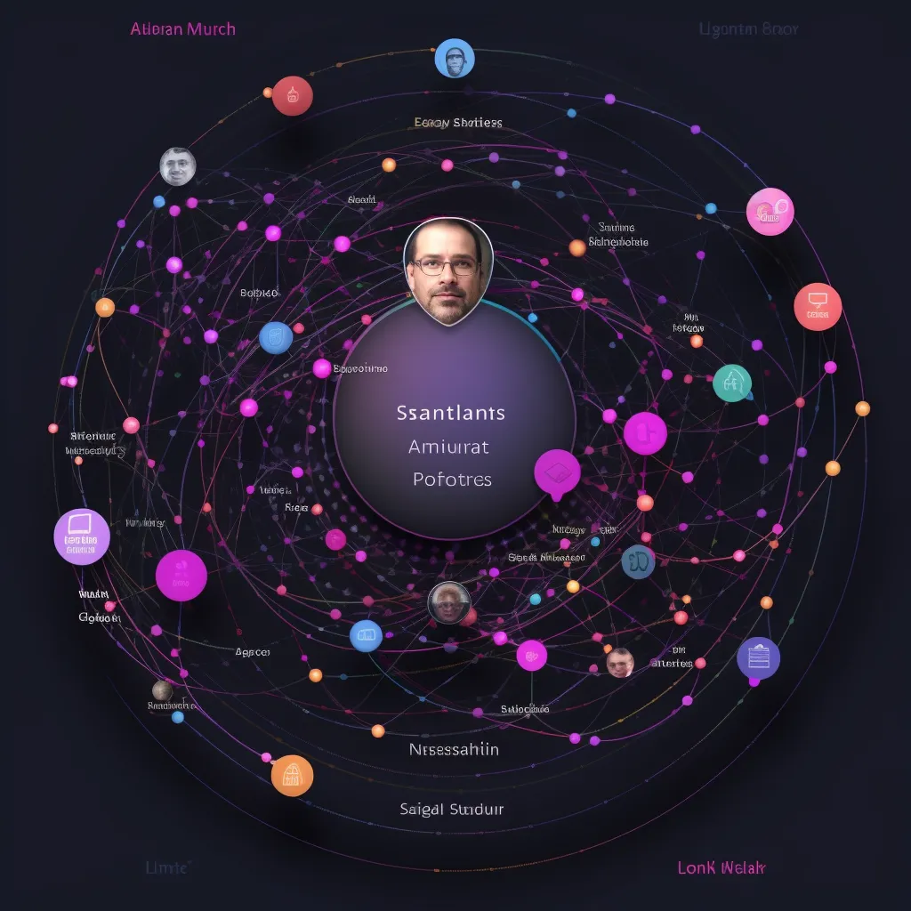
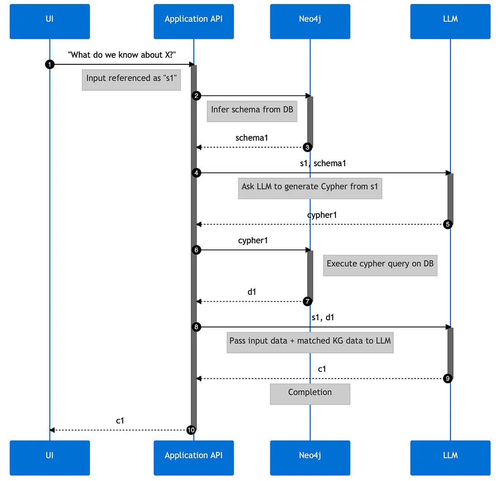
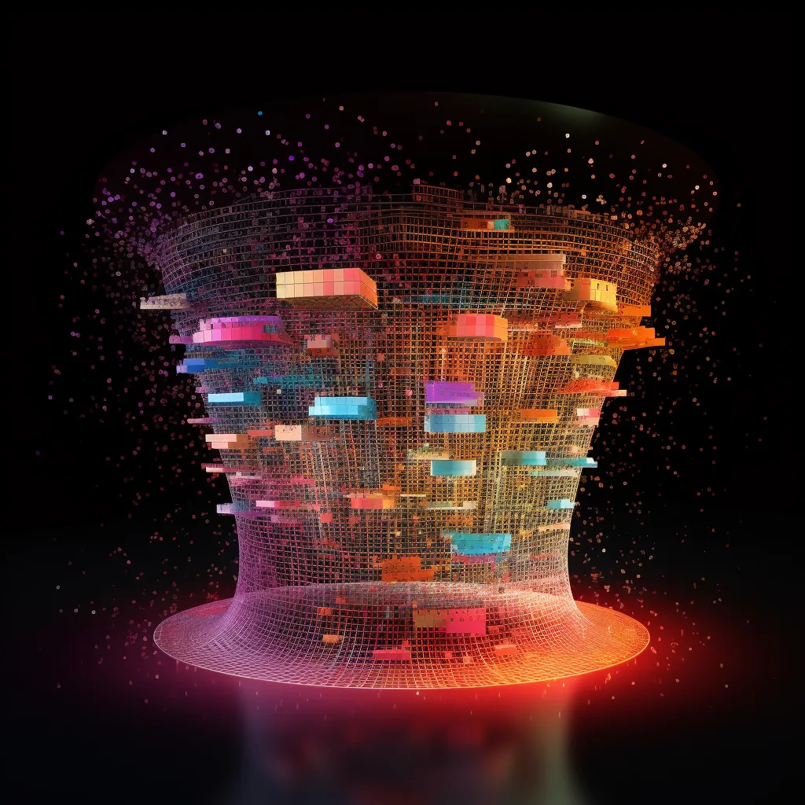

<!-----

You have some errors, warnings, or alerts. If you are using reckless mode, turn it off to see inline alerts.
* ERRORs: 0
* WARNINGs: 0
* ALERTS: 5

Conversion time: 2.015 seconds.

Using this Markdown file:

1. Paste this output into your source file.
2. See the notes and action items below regarding this conversion run.
3. Check the rendered output (headings, lists, code blocks, tables) for proper
   formatting and use a linkchecker before you publish this page.

Conversion notes:

* Docs to Markdown version 1.0β35
* Wed Jan 31 2024 21:21:58 GMT-0800 (PST)
* Source doc: Untitled document
* This document has images: check for >>>>>  gd2md-html alert:  inline image link in generated source and store images to your server. NOTE: Images in exported zip file from Google Docs may not appear in  the same order as they do in your doc. Please check the images!

WARNING:
You have 5 H1 headings. You may want to use the "H1 -> H2" option to demote all headings by one level.

----->

## **Knowledge Graphs & LLMs: Harnessing Large Language Models with Neo4j**

This is the first blog post of Neo4j’s NaLLM project. We started this project to explore, develop, and showcase practical uses of these LLMs in conjunction with Neo4j. As part of this project, we will construct and publicly display demonstrations in a [GitHub repository](https://github.com/neo4j/NaLLM), providing an open space for our community to observe, learn, and contribute. Additionally, we have been writing about our findings in blog posts. You can read the later blog posts here:

* [Fine-Tuning vs Retrieval-Augmented Generation](https://medium.com/neo4j/knowledge-graphs-llms-fine-tuning-vs-retrieval-augmented-generation-30e875d63a35)
* [Multi-Hop Question Answering](https://medium.com/neo4j/knowledge-graphs-llms-multi-hop-question-answering-322113f53f51)

Large Language Models (LLMs) like ChatGPT have taken the world by storm in 2023 due to their ability to understand and generate human-like text. Their capacity to adapt to different conversational contexts, answer questions across a wide range of topics, and even simulate creative writing has revolutionized the way humans and machines interact, sparking a new wave of artificial intelligence applications.

Steampunk computer wall with a magic mirror operated by ants running in transparent tubes (Midjourney)

Thanks to their ability to “understand”, generate, and refine human-like text, LLMs offer us new methods for working with data. Our team at Neo4j has started a project to _explore, develop, _and_ showcase_ practical uses of these LLMs in conjunction with Neo4j.

One key aspect of this project is the integration of graph database technology and concepts into the LLM application stack. By doing so, we expect to enhance the _accuracy, transparency, _and_ predictability_ of the model output and open up new use-cases both for using LLMs as well as databases.

As part of this project, we will construct and publicly display demonstrations in a [GitHub repository](https://github.com/neo4j/NaLLM), providing an open space for our community to observe, learn, and contribute.

_While we base our project on our current understanding and technology, we fully acknowledge that this is a rapidly advancing field, and future findings may refine our approach. Consequently, our perspective and strategies are subject to change in response to new data and technological progress.

# **Identifying the Real-World Use Cases**

The initiation phase of our project focused on the identification of real-world use cases, which would form the basis for our upcoming solutions. After thorough research, market analysis, and customer interactions, we’ve narrowed down **_two initial use cases_** that frequently feature in our conversations with customers.

# **1. Natural Language Interface to a Knowledge Graph**

Our first use case focuses on developing a natural language interface for knowledge graphs. The goal is to create a user interface that simplifies the process of data selection, querying and processing, making data more accessible and easier to understand.

**Allowing you to “talk to your database”.**

Midjourney imagination of a natural language interface for a KG

The preferred method for this is a chat-like interface that would **_generate database queries_** based on the user question and the inferred schema of the database.

Based on feedback from our users, there is a significant demand for **_natural language responses_** over just citing data and linking to sources. By utilizing LLMs, we can provide these responses, presenting information in a way that mimics natural, human conversation.

We’re exploring techniques to inform the LLMs about the content of the knowledge graph. This could involve a similarity search on vectorized content passed via context or fine-tuning a model on the knowledge graph itself.

    

Example sequence diagram of a NL interface to KG solution could look like

However, while simplicity and comprehensibility are important, so too are the **_accuracy and credibility of information_**. To ensure this, all responses should include _links to source data_, offering full transparency and traceability.

These advancements for LLMs and their integration into knowledge graph interfaces represent an exciting step forward in making complex data more user-friendly and trustworthy.

# **2. Creating a Knowledge Graph From Unstructured Data**

The second use case showcases the creation of knowledge graphs from a multitude of unstructured data sources, including but not limited to PDFs, HTML pages, and text documents.

Midjourney has no good concepts of sieves or funnels transforming information :)

LLMs interpret various types and meanings in the text, making sense of unstructured data by identifying its inherent structure based on the training data.

They can

* decipher entities,
* discern relationships, and
* eliminate redundancies by recognizing duplicates.

In effect, LLMs can transform a seemingly indistinguishable mass of unstructured text into a well-organized, meaningful knowledge graph of entities and their relationships.

    

Example sequence diagram of KG creation could look like

Interestingly you can guide LLMs with the appropriate prompts to output structured data directly, e.g. as JSON data structures for node- and relationship-lists, that we can feed directly into the graph database.

By leveraging LLMs in this way, we can streamline the knowledge graph creation process, improving efficiency and accuracy. Especially the disambiguation helps with the many variants we humans put into our texts for the same entities and relationships just to entertain the reader.

As a result, valuable data becomes easier to access, understand, and use for decision-making.

# **Next Steps**

As the project progresses, our goal will be to develop prototypes for these use cases. We aim to improve the interaction between you, the users, and your connected data using Neo4j and LLMs.

Keep an eye out for updates from our team as we progress the development of this project, all of which will be openly documented on our GitHub repository: [https://github.com/manasa-sk/NaLLM](https://github.com/manasa-sk/NaLLM)
